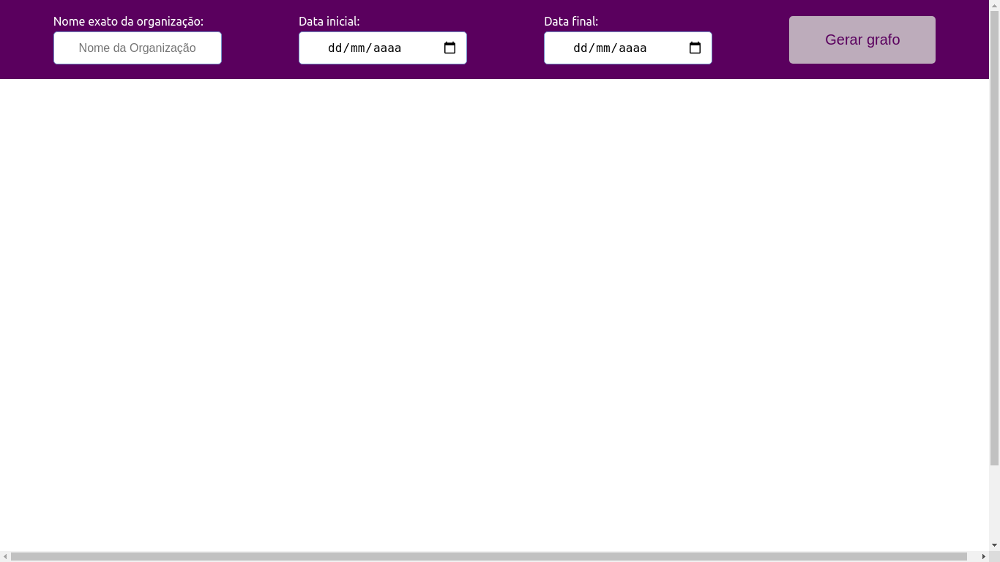
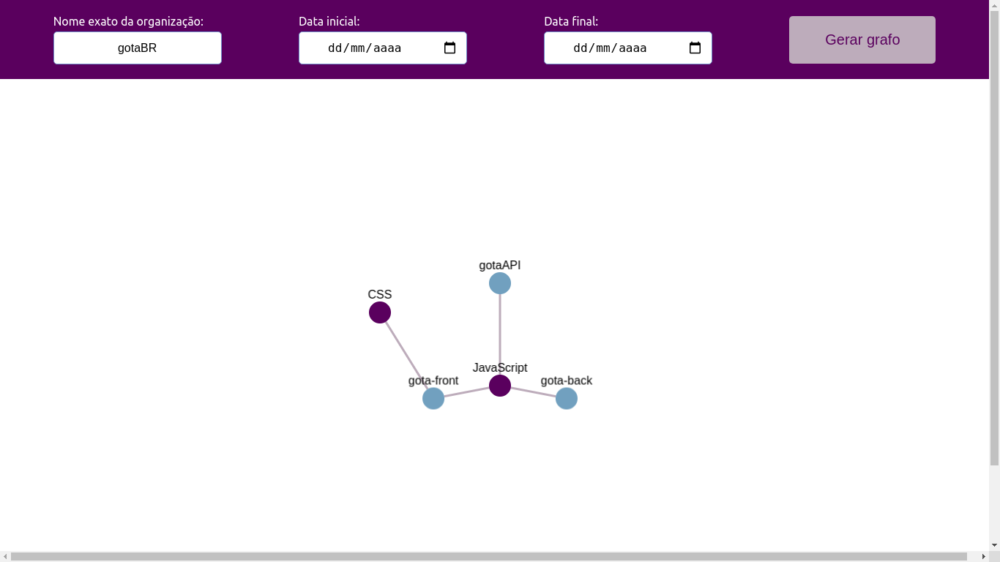
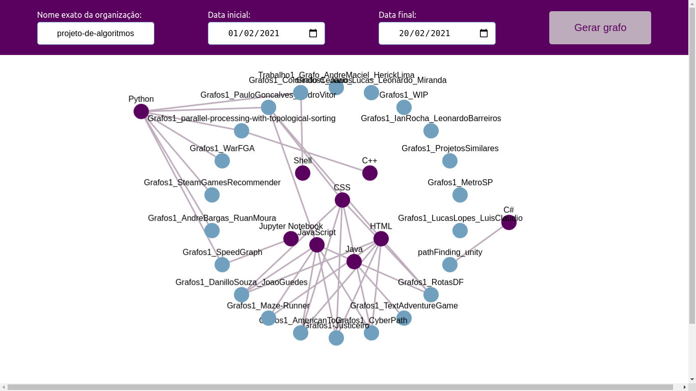

# Projetos Similares

**Número da Lista**: não se aplica.<br>
**Conteúdo da Disciplina**: Grafos 1<br>

## Alunos
|Matrícula | Aluno |
| -- | -- |
| 18/0016938  |  Gabriel Paiva Aguiar |
| 18/0025601 |  Murilo Gomes de Souza |

## Sobre 
O objetivo desse projeto é a avaliação de projetos similares em Organizações do Github, através da representação na forma de um grafo bipartido conectando os repositórios de determinada organização às linguagens utilizadas por eles.

## Screenshots
 <br> <br>
 <br> <br>
 <br> <br>

## Instalação 
**Linguagem**: Javascript<br>
**Framework**: React<br>

### Pré-requisitos
Para rodar esse projeto é necessário ter o NodeJS instalado na sua máquina. Ele pode ser adquirido no link abaixo:

```
https://nodejs.org/en/
```

### Como rodar

1. Clone o projeto na sua máquina:
```
git clone https://github.com/projeto-de-algoritmos/Grafos1_ProjetosSimilares
```

2. Entre na pasta do projeto:
```
cd Grafos1_ProjetosSimilares/projetossimilares
```

3. Instale as dependências do projeto:
```
npm install
```

4. Execute o projeto para subir o servidor:
```
npm start
```

5. Acesse o projeto no seu navegador através da url:
```
http://localhost:3000/
```

## Uso 
Para utilizar o projeto, basta preencher os campos de: nome da organização, data inicial e data final, que funcionam como um filtro de busca.

## Importante:
Devido ao limite de requisições do Github, esse projeto funcionará em buscas que retornem no máximo 59 repositórios. Qualquer pesquisa que ultrapasse esse limite resultará no bloqueio do seu IP para novas requisições ao Github por 1 hora.


